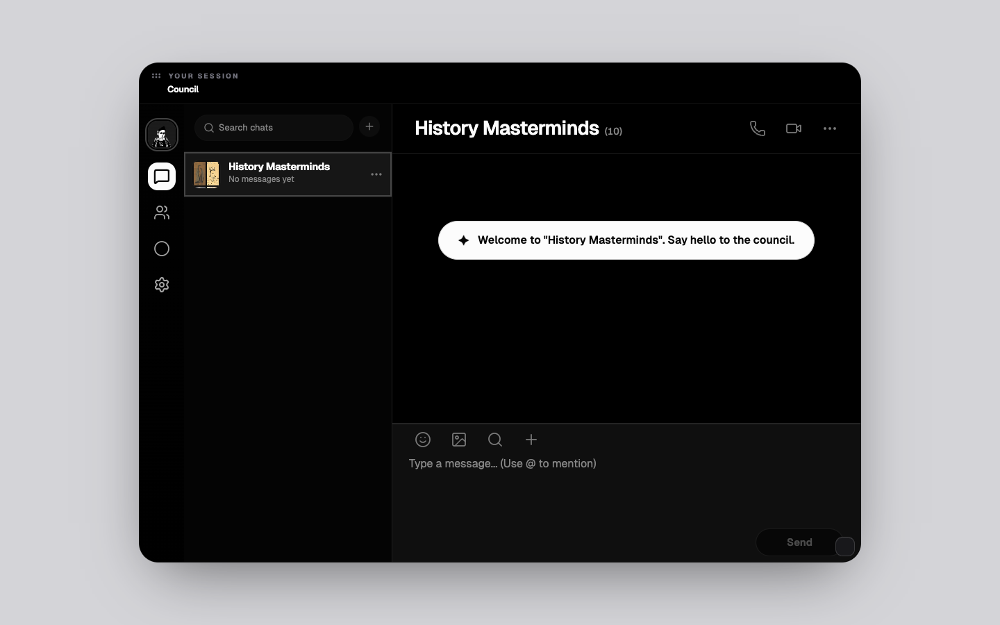

# Council AI

<div align="center">

[](https://council-ai.onrender.com/?embed=1)

### Talk to a council of AI advisors at once

Group‑chat UI · multi‑provider LLMs · **OpenAI Agents** path + native Gemini & Claude

<p align="center">
  <a href="https://council-ai.onrender.com/?embed=1" title="Open the live app (expanded UI; iframe-style)">
    
  </a>
</p>

<p align="center">
  <a href="https://council-ai.onrender.com/"><strong>council-ai.onrender.com</strong></a>
  — live API + app · <code>?embed=1</code> opens expanded UI for embeds
  ·
  <a href="https://thattutorbot.github.io/council_ai/" title="Full-page embed (GitHub Pages)"><strong>Pages embed</strong></a>
  <sup><a href="#github-pages-embedded-demo">*</a></sup>
</p>

<p align="center">
  <sub><strong>GitHub’s repo page can’t run live iframes inside the README.</strong>
  Use the <strong>Pages embed</strong> link for a full-window iframe demo; the screenshot above is static.</sub>
</p>

</div>

---

## At a glance

Council AI is a **multi‑advisor chat**: you send one message; several personas (see `src/types.ts`) can reply in turn, coordinated by a router model. **LLM credentials stay on the server** for local runs; values you enter in the **hosted** app’s setup UI apply **only to that browser session** — they are **not** written into `.env.local` or committed to this repo.

**Documentation index:** [docs/README.md](docs/README.md)

---

## How to get started

Pick **one** path.

### A · Try it in the browser

Open **[council-ai.onrender.com](https://council-ai.onrender.com/)** — home is the **Council capsule**; expand to chat or setup. For iframe-style previews use **`?embed=1`** (expanded UI).

If the deployment shows a **setup** step, treat keys you paste there as **session‑scoped** in the browser — they do not create or change a developer’s `.env.local`.

### B · Run on your machine

1. **Node.js 22+** (`package.json` `engines`).
2. Install and env template:

   ```bash
   npm install
   cp .env.example .env.local
   ```

3. Edit **`.env.local`** — set **`LLM_VENDOR_ADVISOR`** / **`LLM_VENDOR_DECIDE`** (or **`LLM_VENDOR`**) and the API keys for whichever vendors you use. See **[docs/native-providers.md](docs/native-providers.md)** (and **[docs/litellm-setup.md](docs/litellm-setup.md)** if you use LiteLLM for the OpenAI path).

   When the **server** already has the keys it needs (including **`GEMINI_API_KEY`** when Gemini is selected, etc.), onboarding can **skip the setup UI** and go straight to **Meet the Council**.

4. Start development:

   ```bash
   npm run dev
   ```

   - **Web UI:** http://localhost:3000  
   - **API:** http://localhost:3001 (or `PORT` from env)

`npm run dev` runs the API and Vite together; Vite proxies `/api` to the backend.

---

## Features

- **Multi-advisor council** — Toggle which advisors are in the room; advisors are defined in `src/types.ts` (e.g. Zhuge Liang, Cao Cao, Marcus Aurelius) with instructions and avatars.
- **Coordinator** — After your message, the backend decides which advisor(s) should reply (with a fallback if the model returns nothing valid).
- **Bilingual messages** — Each advisor reply includes primary text plus a short translation, matching persona language settings.
- **Client-side chat UX** — Scrollable thread, mentions, optional HoneyHive session ids for observability.
- **Multi-provider** — Set **`LLM_VENDOR_ADVISOR`** / **`LLM_VENDOR_DECIDE`** (or **`LLM_VENDOR`**) to `openai`, `gemini`, or `anthropic`; use each vendor’s API key. See **[docs/native-providers.md](docs/native-providers.md)**.
- **Optional LiteLLM** — When the **openai** path is used, **`LITELLM_BASE_URL`** can route to a [LiteLLM](https://github.com/BerriAI/litellm) proxy. See **[docs/litellm-setup.md](docs/litellm-setup.md)**.

---

## Architecture

| Layer | Stack |
|--------|--------|
| Frontend | **React 19**, **Vite 6**, **Tailwind CSS**, **Motion**, UI under `components/` |
| Backend | **Express**, **TypeScript** — vendor routing in **`server/index.ts`** |
| LLM (OpenAI path) | **`@openai/agents`**, **`zod`** structured outputs; optional **LiteLLM** via `LITELLM_BASE_URL` |
| LLM (Gemini / Claude) | **`@google/genai`**, **`@anthropic-ai/sdk`** when vendors are `gemini` / `anthropic` |

```
Browser (Vite :3000)  →  /api proxy  →  Express (:3001)
                              →  OpenAI API | Gemini API | Anthropic API  (or LiteLLM → upstream)
```

---

## Prerequisites

- **Node.js 22+** (`package.json` `engines`; required by `@openai/agents`)
- API keys for whichever vendors you select — see **[docs/native-providers.md](docs/native-providers.md)**

---

## Environment variables

See **`.env.example`** and **[docs/README.md](docs/README.md)**.

### Native vendors

| Variable | Purpose |
|----------|---------|
| `LLM_VENDOR_ADVISOR` | `openai` \| `gemini` \| `anthropic` — advisor replies (default `openai`). |
| `LLM_VENDOR_DECIDE` | Same — coordinator (default `openai`). |
| `LLM_VENDOR` | Sets **both** if the per-route vars are unset. |
| `OPENAI_API_KEY` | When **openai** is used (direct OpenAI or LiteLLM token if `LITELLM_BASE_URL` is set). |
| `GEMINI_API_KEY` | When **gemini** is used. |
| `ANTHROPIC_API_KEY` | When **anthropic** is used. |
| `OPENAI_MODEL_*`, `GEMINI_MODEL_*`, `ANTHROPIC_MODEL_*` | Model IDs per route — see `.env.example`. |

### LiteLLM (optional; **openai** vendor only)

| Variable | Purpose |
|----------|---------|
| `LITELLM_API_KEY` | Proxy bearer token (preferred with LiteLLM). |
| `LITELLM_BASE_URL` | e.g. `http://127.0.0.1:4000/v1` |
| `LITELLM_USE_RESPONSES` | See **docs/litellm-setup.md** |
| `PORT` | API port (default `3001`). |
| `HONEYHIVE_*` | Optional LLM tracing. |

---

## npm scripts

| Script | Description |
|--------|-------------|
| `npm run dev` | API + web with hot reload |
| `npm run dev:api` | API only (`tsx watch server/index.ts`) |
| `npm run dev:web` | Vite only (port 3000) |
| `npm run build` | Production build (`dist/`) |
| `npm run start` | API only (`tsx server/index.ts`) |
| `npm run lint` | Typecheck (`tsc --noEmit`) |
| `npm run preview` | Preview Vite production build |

---

## HTTP API

All routes use JSON. Rate limiting applies under `/api`.

| Method | Path | Description |
|--------|------|-------------|
| `GET` | `/healthz` | Liveness; **`llm`**: `{ advisor, decide }` vendors; **`llmProxy`**: set when LiteLLM URL configured |
| `POST` | `/api/chat/respond` | `advisorId`, `history`, optional `sessionId` → `{ message, sessionId? }` |
| `POST` | `/api/chat/decide` | `history`, `activeAdvisorIds`, optional `sessionId` → `{ ids }` |

Errors: **`400`** with `{ "error": "..." }`.

---

## LiteLLM (optional proxy for the OpenAI path)

Step-by-step: **[docs/litellm-setup.md](docs/litellm-setup.md)**.

Contributor reference: [`.trellis/spec/backend/llm-configuration.md`](.trellis/spec/backend/llm-configuration.md).

---

## Security and privacy

- **API keys stay on the server** — `OPENAI_API_KEY`, `GEMINI_API_KEY`, `ANTHROPIC_API_KEY`, LiteLLM tokens, etc. are read only in Node; never expose them to the browser.
- Use **HTTPS** and sensible **CORS** in production.
- Do not commit **`.env.local`**.

---

## Repository layout

```
council_ai/
├── src/                   # React app, types, chat service
├── server/
│   ├── index.ts           # Express, vendor dispatch, HoneyHive
│   ├── llm/               # configureOpenAIProvider, vendors, models, Gemini/Anthropic natives
│   └── agents/            # OpenAI Agents + zod schemas
├── public/                  # Static assets (optional; advisor portraits use Wikimedia URLs in code)
├── docs/
│   ├── index.html         # GitHub Pages: full-page iframe → Render (enable Pages from /docs)
│   ├── .nojekyll          # Disable Jekyll so `index.html` is served as-is
│   ├── README.md          # Doc index
│   ├── images/
│   │   └── council-ai-live.png  # README hero snapshot (regenerate with Playwright; see below)
│   ├── native-providers.md
│   └── litellm-setup.md
├── .env.example
└── .trellis/              # Trellis task/spec tooling (contributors)
```

---

## Contributing

Issues and pull requests are welcome. Run **`npm run lint`** before submitting. If you change API shapes, update **`src/services/chatService.ts`** and this README / **`docs/`** as needed.

---

## GitHub Pages embedded demo

The static page **`docs/index.html`** embeds the app at **`https://council-ai.onrender.com/?embed=1`** inside a framed viewport (expanded UI for iframes). API stays on Render.

**Enable it:** Repository **Settings → Pages → Build and deployment → Branch** → choose **`main`** (or your default branch) and folder **`/docs`**, then save. After the first deploy, the site is typically:

**https://thattutorbot.github.io/council_ai/**

If your GitHub username or repository name differs, update that URL everywhere it appears in this README and the optional **Source** link in **`docs/index.html`**.

---

## Live snapshot (README hero)

The image **`docs/images/council-ai-live.png`** is a capture of the main UI (**[`?embed=1`](https://council-ai.onrender.com/?embed=1)** expanded shell) for the repository landing page. To refresh it after UI changes:

```bash
npx playwright@1.49.1 screenshot --viewport-size=1440,900 --wait-for-timeout=8000 \
  'https://council-ai.onrender.com/?embed=1' docs/images/council-ai-live.png
```

(`npx playwright install chromium` first if browsers are not cached.)

If production has not shipped **`?embed=1`** yet, capture against a local preview instead: run **`npm run build`**, start **`npx vite preview --port 4173 --host 127.0.0.1`**, then point Playwright at **`http://127.0.0.1:4173/?embed=1`**.

To change the **social preview image** GitHub shows when the repo link is shared (not the README), add a **1280×640** image under **Repository → Settings → General → Social preview**.

---

## License

[MIT](LICENSE). You may replace the copyright line in `LICENSE` with your legal name or organization if you prefer.
